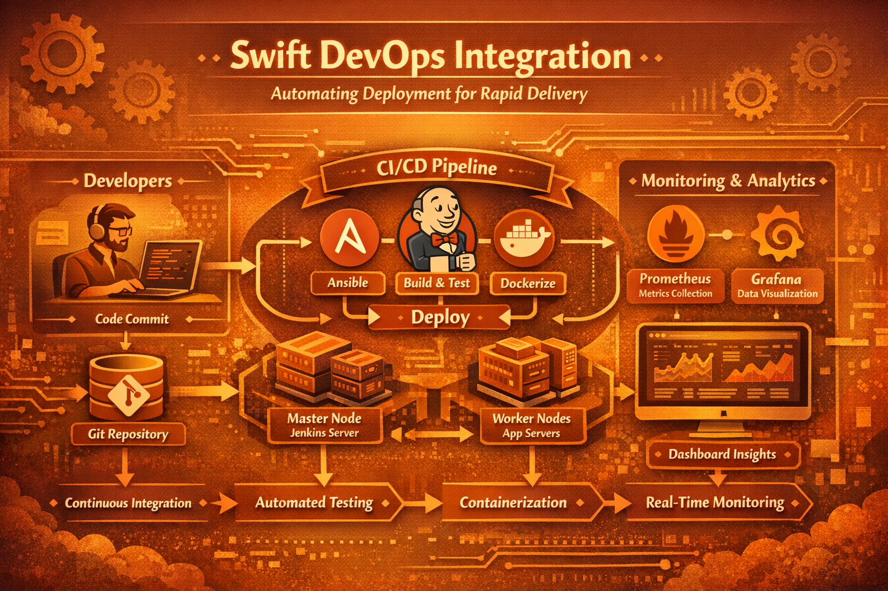

<!-- ================= HERO SECTION ================= -->

  

  
  
  
  
  

---

## 🧭 Architecture

  

# ☕ Swift DevOps Integration  
### *Automating Deployment for Rapid Delivery*

> A production-oriented DevOps implementation focused on **automation, reliability, and observability**.

This project demonstrates how to **rapidly implement a full DevOps lifecycle** using industry-standard tools.  
It covers **infrastructure provisioning**, **CI/CD automation**, **containerization**, and **real-time monitoring** — enabling faster releases with confidence.

---

## 🧭 Architecture Overview

---

## 📚 Table of Contents

- [Project Requirements](#-project-requirements)
- [Installation](#-installation)
- [Usage](#-usage)
- [Implementation Steps](#-implementation-steps)
- [Features](#-features)

---

## 📦 Project Requirements

### 🖥 Infrastructure Setup
- **OS:** Ubuntu 22.04 LTS  
- **Instances:**
  - 1 × Jenkins Master
  - 2 × Worker Nodes (Test & Prod)

### 🌐 Networking
- Full inter-node communication
- Open ports:
  - `22` (SSH)
  - `8080` (Jenkins)
  - `80 / 443` (HTTP / HTTPS)

### ⚙️ Hardware
| Type | CPU | Memory |
|-----|----|--------|
| Minimum (t2.micro) | 1 vCPU | 1 GB |
| Recommended (t2.medium) | 2 vCPU | 4 GB |

---

## 🔧 Installation

  
🔧 Installation Steps (Click to Expand)

  1. **Install Ansible on Ubuntu:** [Ansible Commands](https://docs.ansible.com/)
  2. **Install Jenkins on Ubuntu:** [Jenkins Guide](https://www.jenkins.io/)
  3. **Install Java:** `sudo apt install openjdk-17-jre`
  4. **Install Docker:** `sudo apt install docker.io`
  

## ☕ Usage & Workflow

> [!NOTE]
> **Infrastructure Provisioning with Ansible**  
> Ansible automates the installation and configuration of essential software across all nodes. This guarantees consistency, eliminates manual errors, and drastically reduces environment setup time.

> [!NOTE]
> **Streamlined Git Workflow**  
> A structured Git workflow enables seamless collaboration, efficient version control, and safe code reviews. This improves code quality and minimizes merge conflicts during development.

> [!NOTE]
> **Automated Testing & Deployment**  
> Jenkins automates build, test, and deployment stages. Early detection of issues improves reliability and ensures every deployment is repeatable and predictable.

> [!NOTE]
> **Containerization with Docker**  
> Docker packages applications with their dependencies, ensuring consistent behavior across environments. It simplifies scaling and supports a microservices-oriented architecture.

> [!NOTE]
> **CI/CD Pipelines with Jenkins**  
> Jenkins pipelines automatically trigger builds, run tests, and deploy applications based on branch workflows, enabling faster releases and reduced time-to-market.

> [!NOTE]
> **Monitoring & Observability**  
> Prometheus collects system and application metrics, while Grafana visualizes them in real time—helping teams proactively detect issues and optimize performance.

> [!NOTE]
> **Scalability & Efficiency**  
> Together, these DevOps practices enhance system reliability, scalability, and delivery speed—allowing teams to focus more on innovation than operations.

---

### Steps
**1. Launch EC2 Instances:**
   - Master Instance:
     - Launch an Ubuntu 22.04 LTS instance (t2.micro).
     - Assign a security group allowing inbound traffic on SSH (port 22), HTTP, and HTTPS for administration.
   - Slave Instances (x2):
     - Launch two additional Ubuntu 22.04 LTS instances (t2.micro).
     - Assign the same security group as the master instance.
 

**2. Install Ansible on Master Instance:**
  Refer to the command given in the ***Installation part***

**3. Create Ansible Cluster**
   - Generate an SSH Key on the ***Master Machine***
   - Run the following command and hit enter three times:
     
     `ssh-keygen`
   - Retrieve the public key:

     `sudo cat /home/ubuntu/.ssh/id_rsa.pub`
   - Copy the SSH Key to the ***Test Machine***
     
     `cd .ssh`
     
     `ls`
     
     `sudo nano authorized_keys`
   - Paste the copied SSH key into the authorized_keys file, then save and exit for test and prod machine:
       - Paste the SSH key
       - Press `Ctrl+S` to save
       - Press `Ctrl+X `to exit
   -  Configure Ansible on the Master Machine:
       - Navigate to the Ansible directory:

         `cd /etc/ansible`
         
         `ls`
        - Open the host file to edit:

          `sudo nano hosts`
        - Add the Private IP addresses of both slaves:
    
          `[Test]
          <Private IP of Test>`
          
          `[Prod]
          <Private IP of Prod>`
       - Save and exit:
         - Press `Ctrl+S` to save
         - Press `Ctrl+X `to exit
- Test Ansible Configuration
 ` ansible -m ping all`

**4. Create Ansible Playbook for Dependencies**
> [!NOTE]
> Available in the Repository with the name of the ***play.yaml***

**5. Create Scripts for Master and Slaves**
> [!NOTE]
> Available in Repository with the name of the ***master.sh*** and ***slaves.sh***
  - Run the Playbook:
    
    `ansible-playbook play.yaml --syntax-check`
    
    `ansible-playbook play.yaml --check`
    
    `ansible-playbook play.yaml`
> [!IMPORTANT]
>- Check Jenkins and Java on master:
> `java --version`
>- Check java and docker on Prod and Test:
> `java --version` 
> `docker --version`

**6. Launch Jenkins Dashboard:**
   - Copy the public IP of the master go to a new tab and run it with port 8080.
     
     Public IP:8080
   - Copy the path of Jenkins where the password is given.
     
     (/var/lib/jenkins/secrets/initialAdminPassword)
   - Go back to your master:
     
     `sudo cat /var/lib/jenkins/secrets/initialAdminPassword`
   - Copy the password
   - Go back to Jenkins dashboard
     - Paste Password
     - Continue
     - Install suggested plugins
     - Fill the login details as per your choice
     - Continue and finish.

**7. Create Dockerfile on GitHub**
> [!NOTE]
> Available in the Repository with the name of the ***Dockerfile***

**8. Configure Nodes and Jobs:**

**Creation of Nodes**
  - Node Name
     - Test
     - Choose a Permanent agent
   - Remote root directory:
     `/home/ubuntu/jenkins/`
   - Launch method:
     - Choose ***via ssh***
     - Configure Host:
       - Paste the private IP of the Test
   - Create Credentials:
     - Add > Jenkins
       - Kind: `SSH username with private key`
       - Username: `ubuntu`
       - Private key: `enter directly`>  `Paste the Pem file`>  `Add`
   - Host key Verification:
     `Non-verifying strategy`
   - Save and Refresh
> [!IMPORTANT]
> Similarly for Prod Node

**Configuration of Test Job**
  - Go to the Jenkins Dashboard
    - Click New Item
      - Name: Job1
      - Choose a Freestyle project
      - Click on OK
  - Git hub project
    - Add GitHub repository where all the files are available
  - Click on Restrict where the project runs
    - Select the Test Job
  - Source Code Management:
    - Add the same GitHub repository
    - Specify the branch
      `Develop`
  - Click on Github SCM polling:
    - Copy the main URL of the Jenkins Dashboard
      - Navigate To Github
      - Go On Settings
      - Select Webhook
      - Click on Add Webhook
      - Paste the URL ***url/github-webhook/**
      - Add
> [!TIP]
> - Click the link
> - Go on Recent Deliveries to verify the connection

  - Navigate back to the dashboard
  - Save and Build
> [!IMPORTANT]
> Similarly for another test job for the Master branch and a Prod job for the master branch.

**9. Install Grafana and Prometheus**
**Installation of Grafana:**
   - Add Grafana APT Repository
     
     `sudo apt-get update`
     
     `sudo apt-get install -y software-properties-common wget`
     
     `wget -q -O - https://packages.grafana.com/gpg.key | sudo apt-key add -`
     
     `sudo add-apt-repository "deb https://packages.grafana.com/oss/deb stable main"`
   - Install Grafana

     `sudo apt-get update`
     
     `sudo apt-get install grafana`
   - Start and Enable Grafana Service:
     
     `sudo systemctl start grafana-server`
     
     `sudo systemctl enable grafana-server`
   - Access Grafana Web Interface:
     - Open a web browser and navigate to http://localhost:3000 or http://your-ubuntu-machine-ip:3000.

> [!NOTE]
> - The default username is admin.
> - The default password is admin.

**Installation of Prometheus:**
   - Download the latest version of Prometheus
     
    ` wget https://github.com/prometheus/prometheus/releases/download/v2.34.0/prometheus-2.34.0.linux-amd64.tar.gz`
   - Extract the downloaded archive
     
     `tar xvfz prometheus-2.34.0.linux-amd64.tar.gz`
     

10. Configure Grafana and Prometheus**
**Configuration of Grafana:**
    - 
**Configuration of Prometheus:**
    - Navigate to the Prometheus directory:
      
     ` cd prometheus-2.34.0.linux-amd64`
    - Configure Prometheus:
> [!IMPORTANT]
> A basic example is available at the Repository
    - Start Prometheus:
      `./prometheus --config.file=prometheus.yml`
    - Access Prometheus UI: Open a web browser and go to http://localhost:9090 to access the Prometheus web interface.
## 🎯 Features

✅ **Automated Infrastructure Provisioning** with Ansible  
✅ **CI/CD Pipelines** using Jenkins  
✅ **Dockerized Deployment** for seamless scalability  
✅ **Real-time Monitoring** with Prometheus & Grafana  
✅ **Secure & Scalable Architecture** 
